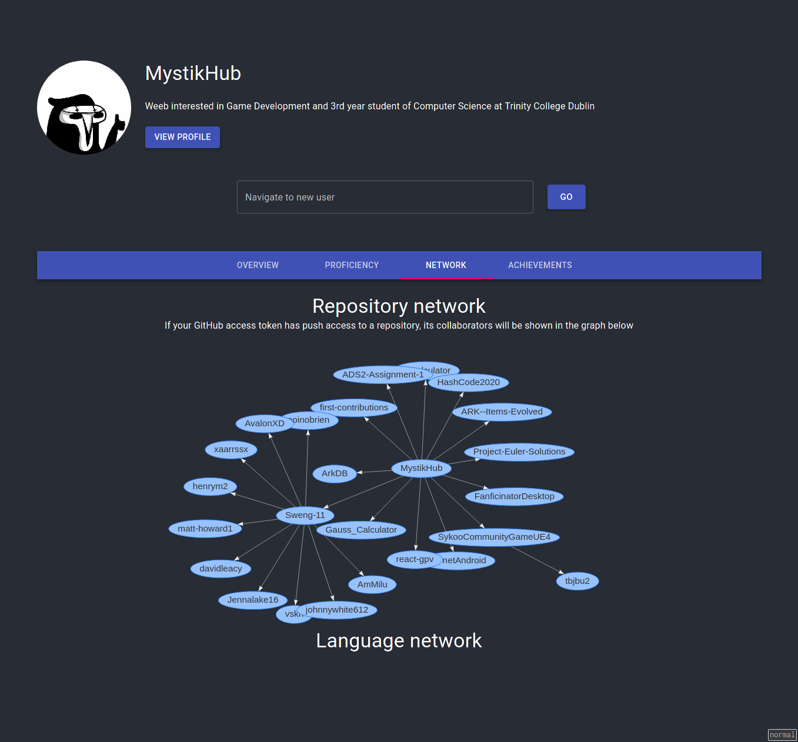

# GitHub Profile Viewer
Web app that provides insights and visualizations for GitHub profiles

This react app provides some insights for any GitHub user. Start off with a GitHub profile and switch between the different tabs to see the visualizations. The app makes API calls for a user's profile information, their activity across the GitHub website, the different languages the user participates in, and which other users worked on their repositories (requires a GitHub API token).

The app uses [Material UI](https://material-ui.com/) for the user interface and runs on Node 14.15.3 (LTS at the time of writing, based on the `node` container with the `lts` tag on [Docker Hub](https://hub.docker.com/_/node/)).

This project was bootstrapped with [Create React App](https://github.com/facebook/create-react-app).

If you're on macOS or Linux, you can run the bash script `run.sh` to build and run the docker container. If you're on Windows, you'll need to add your API token manually (optional) and start the docker container yourself.

## Task list:
- [X] Rough user interface mockup
- [X] Change currently displayed user
- [X] Come up with a solution for no .env file (and the routes requiring authorization)

Overview and influence page
- [ ] User summary
- [X] Level of activity: Enthusiast (100%-50% days) Active member (50-30% days), Lurker (<30%)
- [ ] Role (Programmer, maintainer, problem solver)
- [ ] User frequently works with 
- [ ] Network

Proficiency
- [X] Favorite languages
- [ ] Code changes (+x lines - y lines, bar graph up to 1 month, dropdown menu, hidden for no data)
- [ ] ???

Network visualizations
- [X] User's repositories and contributors
- [ ] Node graph of lanugages -> projects
- [ ] Node graph of users -> projects

### Additional features:

App:
- [ ] Responsive UI (Mobile, tablet, etc)

Achievements (extra features, only if there's extra time available): 
- [ ] List of locked and unlocked achievements
- [ ] We have a problem - open 10 issues
- [ ] Got the bug repellant! - close 10 issues
- [ ] Age - >10 years: veteran, >4 years:  >2 years: apprentice, >1 year: novice, <1 year: newbie
